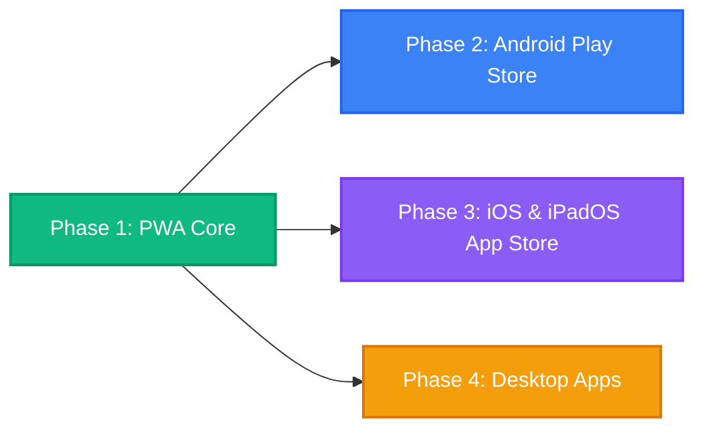

# 📱 Multi-Platform App Distribution Roadmap — 5thGradeCBSE

This document outlines the multi-phase roadmap for distributing the **5thGradeCBSE** interactive learning suite across **Android**, **iOS (iPhones & iPads)**, and **Desktop**, while maintaining a **single codebase** with **automatic web updates**.

---

## 🎯 Architectural Philosophy

1. **Single Source of Truth**:
   - The entire curriculum, UI, state persistence (`localStorage`), audio synthesizers, and question banks live in this single repository.
   - Any bug fix, curriculum addition, or UI enhancement committed here immediately deploys to the web.

2. **Zero Maintenance Web-to-Device Auto-Updates**:
   - Users and students never need to manually download bulky APKs or repeatedly update via app stores for routine question bank and content revisions.
   - The **Service Worker (Stale-While-Revalidate)** engine serves local cache instantaneously (offline-first) while silently checking for updates over-the-air (OTA).

3. **Curriculum & Policy Compliance**:
   - Zero external runtime heavy frameworks (vanilla HTML5/CSS3/ES6+).
   - Strict compliance with official Survey of India cartographic boundaries.
   - Conforms with Google Play families policy & Apple App Store Guideline 4.2 (Rich interactive learning utility with offline persistence, not a thin website bookmark).

---

## 🗺️ Phases at a Glance



| Phase | Target Platforms | Distribution Method | Update Mechanism | Status |
| :--- | :--- | :--- | :--- | :--- |
| **Phase 1** | Android, iOS, iPadOS, Desktop (Windows, Mac, ChromeOS) | **Progressive Web App (PWA)** | Silent Service Worker Stale-While-Revalidate | 🟢 **Complete** |
| **Phase 2** | Android Phones & Tablets | **Google Play Store (TWA / Bubblewrap)** | Instant Web Reflection (Zero Play Store re-review for content) | ⚪ Planned |
| **Phase 3** | iPhones & iPads | **Apple App Store (Capacitor / Web Shell)** | Remote Origin / Live Update Plugin | ⚪ Planned |
| **Phase 4** | Windows PC, Mac, Linux | **MSIX (Windows Store) / Tauri** | PWA Desktop or Tauri lightweight webview | ⚪ Planned |

---

## 🚀 Phase 1: Progressive Web App (PWA) Core (🟢 Completed)

### Objectives
- Transform the existing static web app into an installable PWA.
- Provide full offline functionality so students can practice without an active internet connection.
- Enable automatic over-the-air updates whenever files are updated on GitHub Pages.
- Support native-feeling app launches with splash screens, custom theme colors, and full-screen display.

### Checklist
- [x] Create `APP_DISTRIBUTION_ROADMAP.md` tracking document.
- [x] Create `manifest.webmanifest` with metadata, theme colors (`#0a0e1a`), display `standalone`, and app shortcuts (Maths, Science, English, SST, Hindi, GK).
- [x] Generate crisp high-resolution icons:
  - `icon-192.png` (Standard Android launcher)
  - `icon-512.png` (High-resolution splash)
  - `icon-maskable-512.png` (Adaptive maskable icon with safe zone padding)
  - `apple-touch-icon.png` (iOS Safari home screen icon)
  - `icon.svg` & `favicon-64.png` (Scalable vector favicon and PNG)
- [x] Implement `sw.js` (Service Worker):
  - Pre-cache core shell (`index.html`, `styles.css`, `manifest.webmanifest`, icons).
  - Pre-cache all 7 subject modules for instant offline study.
  - Stale-While-Revalidate caching strategy for subject assets (`/maths/`, `/science/`, etc.).
  - Versioned cache lifecycle (`cbse5-app-v1.0.0`) with automatic stale cache cleanup on activation.
  - `SKIP_WAITING` event handling for instant reload upon update.
- [x] Implement `pwa.js` client controller:
  - Dynamic service worker registration with root scope `./`.
  - `beforeinstallprompt` event listener to show custom "📲 Install App" prompt.
  - iOS Safari instruction helper for "Add to Home Screen".
  - Floating "✨ New content available! [Update Now]" toast notification.
- [x] Add iOS and PWA `<meta>` tags to `index.html` and all subject headers:
  - `apple-mobile-web-app-capable`, `apple-mobile-web-app-status-bar-style`, `viewport-fit=cover`.
- [x] Add safe-area insets (`env(safe-area-inset-top)`, `env(safe-area-inset-bottom)`) in `styles.css` for iPhone notch/dynamic island compatibility.
- [x] Verify CSS brace balance (`0`) across all subject stylesheets.

---

## 🤖 Phase 2: Android Play Store (Trusted Web Activity)

### Objectives
- Package the PWA into a native Android App Bundle (`.aab`) to publish directly on the Google Play Store.
- The TWA opens the hosted web application using Chrome's rendering engine without any browser address bar.
- Because it loads the verified web origin, **any changes pushed to the web are instantly reflected inside the Play Store app without re-submitting to Google Play**.

### Recommended Tooling
- **Google Bubblewrap CLI** (`@bubblewrap/cli`) or **PWABuilder** (Microsoft).

### Step-by-Step Execution Plan
1. **Host PWA on Production Domain / GitHub Pages**:
   - Ensure HTTPS is active and `manifest.webmanifest` passes Google Lighthouse PWA audit (100% score).
2. **Digital Asset Links (`.well-known/assetlinks.json`)**:
   - Link the Android app's SHA-256 certificate fingerprint to the domain so Chrome removes the URL navigation bar completely.
3. **Generate Android Project**:
   ```bash
   npx @bubblewrap/cli init --manifest=https://<your-username>.github.io/5thGradeCBSE/manifest.webmanifest
   npx @bubblewrap/cli build
   ```
4. **Google Play Console Setup**:
   - Create Google Play Developer account ($25 one-time fee).
   - Set up Target Audience: Children (Class 5, Ages 9–11) under Google Play Families Policy.
   - Upload `.aab`, privacy policy URL, and screenshots.

---

## 🍏 Phase 3: Apple App Store (iOS & iPadOS)

### Objectives
- Package the learning suite for iPhone and iPad users who prefer installing directly from the Apple App Store.
- Optimize touch interactions, iPad split screen, Apple Pencil tap targets, and safe area notches.

### Recommended Tooling
- **Capacitor** (`@capacitor/core`, `@capacitor/ios`) by Ionic.

### Architecture for Auto-Updates on iOS
- Apple App Store Guideline 4.2 prohibits purely hollow web wrappers that do nothing offline.
- **Capacitor Setup**:
  1. Web assets are bundled locally for instant offline first-launch.
  2. Use **Capacitor Live Updates** (or an OTA plugin) to sync newer assets from GitHub Pages on launch without needing App Store reviews for curriculum updates.
  3. Comply with Apple Guideline 2.5.2 (OTA code updates are permitted if they do not change the primary purpose of the app and stay within Javascript/Web standards).

### Requirements
- Apple Developer Program Membership ($99/year).
- Mac with Xcode for signing and archiving `.ipa`.
- Privacy manifest (`PrivacyInfo.xcprivacy`) declaring zero tracking.

---

## 💻 Phase 4: Desktop Apps (Windows & macOS)

### Distribution Options
1. **PWA Desktop (Native Browser Install — Zero Effort)**:
   - Built into Chrome and Microsoft Edge on Windows, Mac, Linux, and ChromeOS.
   - Users click the "Install" button in the address bar; it creates a start menu shortcut and taskbar icon, running in a dedicated window.
2. **Microsoft Store (Windows MSIX via PWABuilder)**:
   - Microsoft allows submitting PWAs directly to the Microsoft Store as MSIX packages with zero conversion code.
3. **Tauri Desktop Wrapper (Optional Lightweight Native Executable)**:
   - Tiny native binary (~5 MB) using the operating system's built-in webview (WebView2 on Windows, WebKit on macOS).

---

## 🔄 The Master Workflow: How Updates Work After Setup

Once this multi-platform pipeline is established:

```
[Edit CBSE Questions / Code in Git]
              ↓
      [git push origin main]
              ↓
  [GitHub Pages auto-deploys]
              ↓
┌────────────────────────────────────────────────────────┐
│               AUTOMATIC UPDATE DISPATCH                 │
├──────────────────────────┬─────────────────────────────┤
│ Web & PWA Users          │ Service Worker downloads    │
│ (Android, iOS, Desktop)  │ update in background;       │
│                          │ shows "Update Now" toast    │
├──────────────────────────┼─────────────────────────────┤
│ Google Play (TWA) Users  │ Loads updated web app       │
│                          │ automatically               │
├──────────────────────────┼─────────────────────────────┤
│ iOS App Store (OTA)      │ OTA sync pulls updated      │
│                          │ static bundle               │
└──────────────────────────┴─────────────────────────────┘
```

**Zero multi-codebase maintenance. One git push updates every student's device.**
